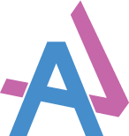

# Adam Van-Vianen

#### [adamvanvianendesign.ca](http://adamvanvianendesign.ca)

Adam Van-Vianen, Graphic Designer

Growing up I have always had really weird ideas. I remember going out to fast food restaurants with my mom, and I would come up with stories on why A&W is called A&W and why Taco Bell is called Taco Bell etc. and explain why I thought they chose that certain slogan and why they chose those brand colors. In other words from a young age I was already coming up with rationales of successful organizations and didn’t even know it.

Graphic design gives me the ability to express my weird ideas and bring what goes on in my mind to life. There are no limits. I believe that creativity is one of the most important strengths and skills to have. I try to be as creative as often as possible and being a graphic designer gives me that ability. It’s like a muscle, the more you work with it the stronger it gets.

I have always loved the aspect of art and marketing. Put those two together and you have graphic design. I believe that I can make people feel something from the work I do and communicate or influence them to do/believe what I design for the user/viewer. If I can do that then my job is complete.

- **[contact@adamvanvianendesign.ca](mailto:contact@adamvanvianendesign.ca)**

---

© Adam Van-Vianen
